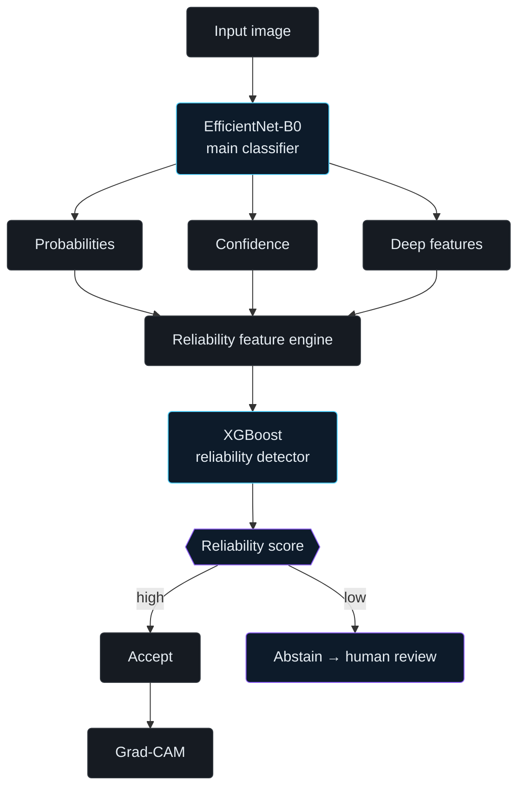

<div align="center">

<br/>

<h1 align="center">
  <sub>
    
  </sub>
  &nbsp;MediShield
</h1>

<p align="center"><sub>A reliability and safety layer for medical vision models</sub></p>

<br/>

<a href="https://github.com/iniya304/MediShield">
  
</a>

<br/><br/>


<br/><br/>

</div>

<div align="center">
<sub>MediShield does not only ask <i>what does the image show</i> — it asks <b>can this prediction be trusted</b>.</sub>
</div>

<br/>

> [!WARNING]
> **Research prototype — not a clinical tool.** MediShield must never be presented, marketed, or used as a substitute for a dermatologist or a clinical diagnostic workflow.

<br/>

---

<br/>

### Contents

<sub>

`01` [Overview](#01--overview) &nbsp;·&nbsp;
`02` [The Core Problem](#02--the-core-problem) &nbsp;·&nbsp;
`03` [Research Questions](#03--research-questions) &nbsp;·&nbsp;
`04` [Beyond Classification](#04--beyond-classification) &nbsp;·&nbsp;
`05` [Architecture](#05--architecture)

`06` [Dataset](#06--dataset) &nbsp;·&nbsp;
`07` [Data Splitting](#07--data-splitting) &nbsp;·&nbsp;
`08` [Preprocessing](#08--image-preprocessing) &nbsp;·&nbsp;
`09` [Models](#09--models) &nbsp;·&nbsp;
`10` [Reliability Detector](#10--reliability-detector)

`11` [Adversarial ML](#11--adversarial-machine-learning) &nbsp;·&nbsp;
`12` [Stress Testing](#12--realistic-stress-testing) &nbsp;·&nbsp;
`13` [Explainability](#13--explainable-ai) &nbsp;·&nbsp;
`14` [Abstention](#14--abstention-mechanism) &nbsp;·&nbsp;
`15` [Coverage vs. Risk](#15--coverage-vs-risk)

`16` [Experiments](#16--experiments) &nbsp;·&nbsp;
`17` [Results](#17--results) &nbsp;·&nbsp;
`18` [Demo](#18--demo) &nbsp;·&nbsp;
`19` [Stack](#19--technology-stack) &nbsp;·&nbsp;
`20` [Structure](#20--project-structure) &nbsp;·&nbsp;
`21` [Setup](#21--how-to-run) &nbsp;·&nbsp;
`22` [Limitations](#22--scientific-limitations)

</sub>

<br/>

---

## 01 — Overview

MediShield is a research prototype for testing and improving the reliability of a medical image classifier. A deep-learning skin-lesion model acts as the **prediction engine**; a second, independent layer evaluates whether each individual prediction actually deserves to be trusted.

The system closes the loop across several disciplines:

&nbsp;&nbsp;medical computer vision &nbsp;·&nbsp; transfer learning (CNNs) &nbsp;·&nbsp; adversarial machine learning &nbsp;·&nbsp; uncertainty analysis
&nbsp;&nbsp;gradient-boosted trees (XGBoost) &nbsp;·&nbsp; explainable AI (Grad-CAM) &nbsp;·&nbsp; selective prediction / abstention

<br/>

**Frame it as**
> "A reliability and safety layer around a medical vision model, tested on whether it can recognize when its own prediction becomes unreliable."

**Not as**
> "A skin-cancer classifier."

<br/>

---

## 02 — The Core Problem

A conventional medical-image pipeline is a single hop:

```
Medical Image  →  CNN  →  Disease Prediction
```
```
Skin lesion  →  EfficientNet-B0  →  Melanoma, 94%
```

A high-confidence prediction is not automatically a trustworthy one. A model can be confidently wrong, unstable under imperceptible input changes, fragile against adversarial perturbation, sensitive to routine degradation (noise, blur, compression, brightness), inconsistent in its own explanations, or simply out of distribution.

MediShield inserts a reliability layer between prediction and output:

```
Image  →  Vision Model  →  Prediction + Confidence + Features
       →  Reliability Analysis  →  Trust / Suspicious
       →  Accept  OR  Abstain
```

<br/>

---

## 03 — Research Questions

**Primary**
> Can we detect when a medical vision model's prediction has become unreliable — especially under adversarial or realistic perturbation?

**Secondary**

1. How much does performance degrade under FGSM and PGD attacks?
2. Does confidence shift meaningfully when the input is perturbed?
3. Can behavioral features distinguish correct from incorrect predictions?
4. Can XGBoost learn to separate trustworthy from suspicious outputs?
5. Does abstention reduce error among the predictions the system chooses to keep?
6. Do Grad-CAM explanations drift under manipulation?

<br/>

---

## 04 — Beyond Classification

Classification is the first layer only. The contribution is the stack on top of it:

```
Classification + Adversarial Stress Testing + Reliability Detection + Abstention + Explainability
```

<div align="center">

**classify → attack → observe → detect → abstain → explain**

<sub>the six-step chain is the identity of the project — not the number of models it contains</sub>

</div>

<br/>

---

## 05 — Architecture



<sub>a parallel stress-testing loop feeds perturbed images through the same pipeline to observe how behavior changes under pressure — <code>clean → FGSM / PGD / noise / blur / brightness / compression → reliability analysis</code></sub>

<br/>

**Component responsibilities**

| Layer | Component | Responsibility |
|---|---|---|
| Prediction engine | EfficientNet-B0 | Classify the lesion; expose probabilities, confidence, deep features |
| Benchmark | ResNet18 | Independent architecture, checks whether reliability issues are model-specific |
| Stress layer | FGSM, PGD, noise, blur, brightness, compression | Perturb the input to probe robustness |
| Feature engine | Custom extraction code | Turn model outputs + perturbation behavior into a feature vector |
| Reliability detector | XGBoost | Predict whether a given prediction is likely correct |
| Decision layer | Threshold-based logic | Convert reliability score into Accept / Abstain |
| Explainability | Grad-CAM | Visualize which regions drove the decision, clean vs. perturbed |
| Interface | Streamlit | Upload an image, run the pipeline, inspect every stage |

<details>
<summary><sub>end-to-end data flow</sub></summary>
<br/>

```
1. User uploads a dermoscopic image
2. Image preprocessed → 224×224, ImageNet normalization
3. EfficientNet-B0 outputs class probabilities, predicted class,
   confidence, and a deep feature embedding
4. (optional) image perturbed via FGSM / PGD / stress transform,
   re-run through step 3 for a second output set
5. Reliability Feature Engine builds a vector from probabilities,
   confidence, margin, entropy, and perturbation-derived behavior
6. XGBoost consumes the vector → reliability probability (0–1)
7. Abstention layer compares score to a validation-tuned threshold
     score ≥ threshold → ACCEPT  → show prediction + Grad-CAM
     score <  threshold → ABSTAIN → flag for human review
8. Grad-CAM renders a heatmap for the accepted prediction
   (clean vs. perturbed, side by side, in stress-test mode)
```

</details>

**Why two separately-trained models.** EfficientNet-B0 is never trained to know whether it is right — it only outputs a softmax distribution. XGBoost is trained on a different signal entirely: not *which disease is this*, but *does this specific prediction look trustworthy given how the classifier behaved*. That separation lets the detector learn patterns — low margin, high entropy, large confidence swings under perturbation — that correlate with error, independent of the underlying disease.

<br/>

---

## 06 — Dataset

MediShield uses **HAM10000** ("Human Against Machine with 10000 training images") — 10,015 dermoscopic images across 7 diagnostic categories, with metadata for image ID, lesion ID, diagnosis, age, sex, localization, and source.

The project restricts itself to three classes:

| Code | Class | Images (full dataset) |
|---|---|---:|
| `bkl` | Benign keratosis-like lesions | 1,099 |
| `mel` | Melanoma | 1,113 |
| `nv` | Melanocytic nevi | 6,705 |

These classes are highly imbalanced (`nv` dominates), so training uses an **approximately balanced subset**, not the raw distribution — a target of roughly 600 images per class, ~1,800 total. This is a target, not a hard requirement; the exact number is set once lesion-level splitting is applied.

**Split ratios** — 70% train · 15% validation · 15% test, with class balance preserved as closely as possible while keeping every image of a given lesion in the same split.

<br/>

---

## 07 — Data Splitting

*Leakage prevention*

HAM10000 contains multiple images of the same physical lesion — different angles, zoom, or lighting of the same spot on the same patient — which makes naive random splitting unsafe.

```
Bad — leaks lesion identity across splits
  Lesion A → Image A1 → Training
  Lesion A → Image A2 → Test

Correct — split at the lesion level
  Lesion A → all images → Training      (or Validation, or Test)
```

> **Rule:** the same `lesion_id` never appears in more than one of Train / Validation / Test.

<br/>

---

## 08 — Image Preprocessing

| Step | Detail |
|---|---|
| Target tensor | `224 × 224 × 3`, RGB |
| Normalization | ImageNet mean/std — both backbones are ImageNet-pretrained |
| Training augmentation | Resize, crop, horizontal flip, small rotation — kept mild to avoid unrealistic medical images |
| Validation / test | Deterministic only — resize + normalize, no random augmentation, for reproducible evaluation |

<br/>

---

## 09 — Models

**EfficientNet-B0 — main classifier.** Predicts the lesion class and exposes the internal signals the reliability layer consumes downstream. Trained via transfer learning — an ImageNet-pretrained backbone with the classification head replaced for 3 classes — rather than from scratch.

```
Image → EfficientNet-B0 → class probabilities → predicted class → deep features
```

**ResNet18 — benchmark.** Used to check whether the reliability problem is specific to one architecture or generalizes across architectures. A comparison point, not the centerpiece; EfficientNet-B0 remains primary and ResNet18 does not need extensive tuning.

<br/>

---

## 10 — Reliability Detector

XGBoost is not a disease classifier — its job is to predict whether the deep model's prediction is likely correct.

```
EfficientNet → prediction, confidence, probabilities, feature statistics,
               perturbation behavior  →  XGBoost  →  reliability probability
```

```
reliability = 0.94  →  prediction appears reliable
reliability = 0.18  →  prediction appears suspicious
```

The acceptance threshold is chosen experimentally on validation data (see [§14 Abstention](#14--abstention-mechanism)).

**Features**

| Feature | Description |
|---|---|
| Prediction probabilities | `P(bkl)`, `P(mel)`, `P(nv)` |
| Confidence | `max_probability` |
| Margin | Gap between top-1 and top-2 probability — e.g. 0.94 vs. 0.04 → margin 0.90 |
| Entropy | How spread out the distribution is — `[.94,.04,.02]` is far more decisive than `[.36,.34,.30]` at the same top-1 class |
| Perturbation behavior | Confidence change, probability shift, class-flip flag, deep-feature shift, cross-perturbation consistency |

**Training.** Labels come from ground-truth correctness, not an arbitrary confidence cutoff:

```
ground truth vs. EfficientNet prediction → correct? → yes: reliable (1)  /  no: unreliable (0)
```

> Reliability is **not** defined as `confidence > 0.5` — that would make the detector reproduce an arbitrary threshold instead of learning a genuine signal. XGBoost instead learns **model behavior → prediction reliability**.

<br/>

---

## 11 — Adversarial Machine Learning

How the classifier behaves under *intentional* perturbation — one of the project's main differentiators.

**FGSM** (Fast Gradient Sign Method) — a single gradient-based step: `clean image → gradient-based perturbation → adversarial image → classifier`. Measured: clean vs. adversarial accuracy, prediction changes, confidence changes, attack success rate.

**PGD** (Projected Gradient Descent) — the same idea applied iteratively: `small perturbation → gradient → update → project → repeat → adversarial image`. A stronger, multi-step version of the same attack family.

> FGSM and PGD are attack *methods*, not separate trained models — transformations applied at evaluation time.

<br/>

---

## 12 — Realistic Stress Testing

Adversarial attacks alone don't represent everyday failure modes, so the pipeline also runs a stress-test suite of realistic degradations:

```
clean → FGSM → PGD → Gaussian noise → blur → brightness shift → compression
```

For each condition the pipeline measures accuracy, confidence, whether the prediction changed, the reliability score, and the resulting abstention rate.

<br/>

---

## 13 — Explainable AI

Grad-CAM is not another model — a visualization method layered on the trained CNN, showing which image regions drove the prediction:

```
original image → Grad-CAM → highlighted region
```

The pipeline compares **clean Grad-CAM vs. perturbed Grad-CAM**; a significant shift in highlighted regions is treated as evidence of *explanation instability* — never as proof of medical correctness.

<br/>

---

## 14 — Abstention Mechanism

A conventional classifier always outputs a prediction. MediShield adds a decision gate instead:

```
input → prediction → reliability score
  high → accept
  low  → abstain → human review
```

```
Prediction:        Melanoma
Model confidence:  91%
Reliability:       23%
Decision:          SUSPICIOUS — human review recommended
```

> A prototype safety behavior — not a clinical recommendation engine.

<br/>

---

## 15 — Coverage vs. Risk

The core evaluation concept for a selective-prediction system.

If the system receives 100 images, accepts 80, and abstains on 20:

```
coverage = 80 / 100 = 80%
```

If 2 of those 80 accepted predictions are wrong:

```
selective risk = 2 / 80 = 2.5%
```

Plotting selective risk against coverage as the reliability threshold varies is a stronger result than plain accuracy alone — it directly shows what abstention buys.

<br/>

---

## 16 — Experiments

| ID | Experiment | Input | Metrics | Status |
|---|---|---|---|---|
| E1 | Baseline EfficientNet | Clean images | Accuracy, precision, recall, F1, confusion matrix | `done` |
| E2 | ResNet18 benchmark | Clean images | Accuracy, F1, confusion matrix | `done` |
| E3 | FGSM attack | FGSM-perturbed | Accuracy drop, confidence change, attack success rate | `done` |
| E4 | PGD attack | PGD-perturbed | Accuracy drop, confidence change, attack success rate | `done` |
| E5 | Reliability detector | Feature vectors | Accuracy, precision, recall, F1, ROC-AUC | `done` |
| E6 | Stress-test matrix | All perturbation types | Accuracy, confidence, prediction consistency, reliability | `in progress` |
| E7 | Abstention | Reliability scores + threshold | Coverage, selective risk, abstention rate | `in progress` |
| E8 | Grad-CAM | Clean vs. perturbed | Qualitative comparison (+ similarity metric, time permitting) | `in progress` |

<sub>status values are illustrative — update per row to reflect actual progress</sub>

**Minimum required outputs:** baseline metrics, confusion matrix, FGSM results, PGD results, reliability-detector metrics, stress-test comparison, coverage–risk plot, Grad-CAM examples, working demo.

<br/>

---

## 17 — Results

<details>
<summary><sub>expand result tables — placeholders, fill in after running experiments</sub></summary>
<br/>

**Classification**

| Model | Accuracy | Precision | Recall | F1 |
|---|---:|---:|---:|---:|
| EfficientNet-B0 | TBD | TBD | TBD | TBD |
| ResNet18 | TBD | TBD | TBD | TBD |

**Adversarial robustness**

| Condition | Accuracy | Avg. confidence | Prediction change |
|---|---:|---:|---:|
| Clean | TBD | TBD | — |
| FGSM | TBD | TBD | TBD |
| PGD | TBD | TBD | TBD |

**Stress testing**

| Condition | Accuracy | Confidence | Reliability |
|---|---:|---:|---:|
| Clean | TBD | TBD | TBD |
| FGSM | TBD | TBD | TBD |
| PGD | TBD | TBD | TBD |
| Noise | TBD | TBD | TBD |
| Blur | TBD | TBD | TBD |
| Brightness | TBD | TBD | TBD |
| Compression | TBD | TBD | TBD |

**Reliability detector**

| Metric | XGBoost |
|---|---:|
| Accuracy | TBD |
| Precision | TBD |
| Recall | TBD |
| F1 | TBD |
| ROC-AUC | TBD |

</details>

<br/>

---

## 18 — Demo

The Streamlit dashboard follows this interface:

```
┌──────────────────────────────────────────┐
│  MEDISHIELD — Medical AI Reliability Monitor
├──────────────────────────────────────────┤
│  [ Upload Skin Lesion Image ]              │
│                                            │
│  Prediction:   Melanoma                   │
│  Confidence:   91%                        │
│  Reliability:  24%                        │
│  → SUSPICIOUS — human review recommended  │
│                                            │
│  [ Show Grad-CAM ]   [ Run Stress Test ]  │
└──────────────────────────────────────────┘
```

**What this demonstrates**

1. Upload a clean image → `Melanoma, 94% confidence, 96% reliability → trusted`
2. Run FGSM → the system perturbs the same image
3. Compare — original `Melanoma 94%` vs. perturbed `Nevus 82%`
4. Reliability layer reacts → `18% → suspicious / abstain`
5. Grad-CAM shows clean vs. perturbed explanation side by side

The point of the demo: the system is not only predicting — it is checking whether the prediction stays trustworthy under stress.

<sub>a recorded screen-capture of this exact flow, placed at <code>assets/demo.gif</code> and referenced as <code></code>, is the highest-value visual addition to this section.</sub>

<br/>

---

## 19 — Technology Stack

<div align="center">


</div>

<br/>

| Category | Tools |
|---|---|
| Machine learning | Python, PyTorch, Torchvision, XGBoost, Scikit-learn |
| Computer vision | PIL, OpenCV (as needed) |
| Explainability | Grad-CAM implementation/library |
| Dashboard | Streamlit |
| Development | Google Colab (T4 GPU) for training/attacks/evaluation · VS Code for local dev · Git/GitHub for version control |

| Component | Technology | Purpose |
|---|---|---|
| Main classifier | EfficientNet-B0 | Medical image classification |
| Benchmark | ResNet18 | Architecture comparison |
| Reliability model | XGBoost | Predict prediction reliability |
| Attack 1 | FGSM | Adversarial robustness |
| Attack 2 | PGD | Stronger adversarial robustness |
| XAI | Grad-CAM | Visual explanation |
| Dashboard | Streamlit | Interactive demo |

<br/>

---

## 20 — Project Structure

<details>
<summary><sub>expand folder tree</sub></summary>
<br/>

```
MediShield/
├── README.md
├── data/
│   ├── metadata/            HAM10000 metadata (image_id, lesion_id, dx, ...)
│   └── processed/           Balanced, lesion-aware train/val/test splits
├── notebooks/
│   ├── 01_data_preparation.ipynb
│   ├── 02_efficientnet_training.ipynb
│   ├── 03_resnet_training.ipynb
│   ├── 04_adversarial_attacks.ipynb
│   ├── 05_reliability_detector.ipynb
│   └── 06_evaluation.ipynb
├── src/
│   ├── data/                Dataset loading, lesion-level splitting, transforms
│   ├── models/               EfficientNet-B0 / ResNet18 definitions and training
│   ├── attacks/               FGSM, PGD, and stress-test transforms
│   ├── reliability/            Feature engineering + XGBoost training/inference
│   ├── explainability/         Grad-CAM implementation
│   └── evaluation/             Metrics, coverage-risk analysis, plotting
├── models/
│   ├── efficientnet.pth
│   ├── resnet18.pth
│   └── reliability_xgb.json
├── results/
│   ├── metrics/                 Saved JSON/CSV metrics per experiment
│   └── figures/                 Confusion matrices, robustness plots, Grad-CAM outputs
└── app/
    └── streamlit_app.py         Interactive demo
```

</details>

<br/>

---

## 21 — How to Run

<sub>exact commands depend on the final implementation — update once <code>src/</code> and <code>app/streamlit_app.py</code> exist</sub>

**Environment**
```bash
git clone https://github.com/iniya304/MediShield.git
cd MediShield
pip install torch torchvision xgboost scikit-learn pillow streamlit
```

**Dataset**
```bash
# download HAM10000 and place metadata/images under data/
jupyter notebook notebooks/01_data_preparation.ipynb
```

**Train**
```bash
jupyter notebook notebooks/02_efficientnet_training.ipynb
jupyter notebook notebooks/03_resnet_training.ipynb
```

**Evaluate + reliability detector**
```bash
jupyter notebook notebooks/04_adversarial_attacks.ipynb
jupyter notebook notebooks/05_reliability_detector.ipynb
jupyter notebook notebooks/06_evaluation.ipynb
```

**Demo**
```bash
streamlit run app/streamlit_app.py
```

<sub>recommended hardware: GPU (e.g. Colab T4) for training and adversarial-example generation; CPU is sufficient for the Streamlit demo and XGBoost inference.</sub>

<br/>

---

## 22 — Scientific Limitations

Stated plainly, for transparency:

- HAM10000 is a benchmark dataset, not a complete representation of real-world clinical populations
- The three-class setup (`bkl`, `mel`, `nv`) is a narrowed research scope, not full dermatological coverage
- FGSM/PGD are controlled experiments — they do not simulate every real-world failure mode
- Reliability detection based on prediction correctness does **not** prove clinical safety
- Grad-CAM highlights what the CNN attended to, not necessarily clinically meaningful features
- The system is **not** a replacement for a dermatologist or a clinical diagnostic workflow

| Preferred language | Avoid |
|---|---|
| "research prototype" | "clinically safe" |
| "model reliability" | "prevents misdiagnosis" |
| "prediction-level safety mechanism" | "doctor replacement" |
| "human-review escalation" | — |

<br/>

---

<br/>

<div align="center">

<sub>MediShield challenges the assumption that a confident medical AI prediction is automatically trustworthy.<br/>
Stress-test the model, learn its reliability patterns, detect suspicious predictions, and abstain when confidence isn't enough.</sub>

<br/><br/>

<sub>if this project is useful, consider starring the repository</sub>

<br/><br/>


</div>
